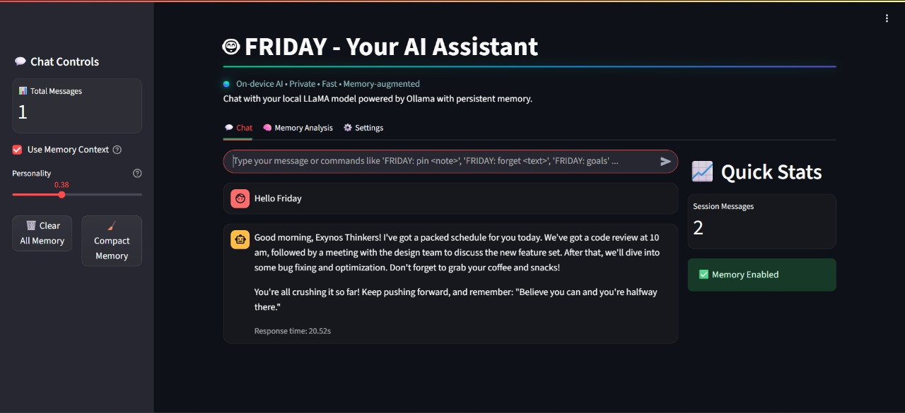
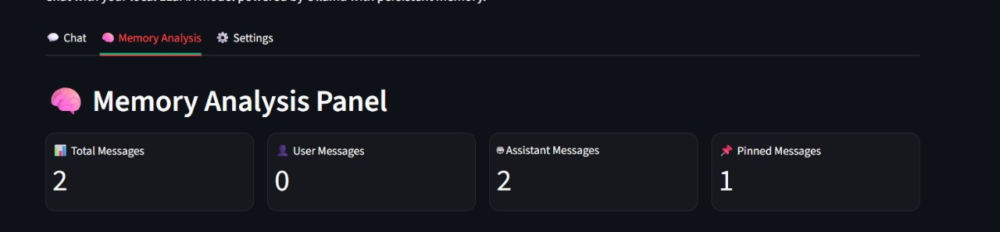
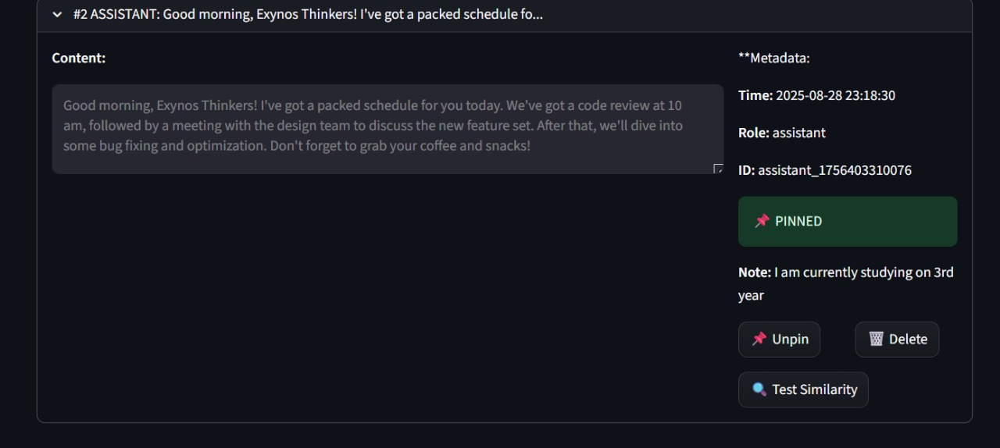
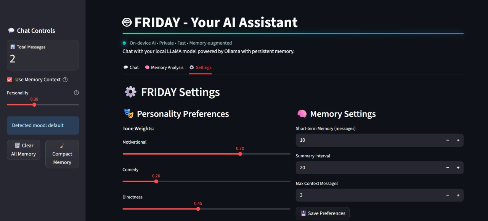

# 🤖 FRIDAY - AI-Powered Memory-Augmented Chat Assistant

[](https://www.python.org/downloads/)
[](https://streamlit.io/)
[](https://www.trychroma.com/)
[](https://ollama.ai/)
[](LICENSE)
[]()

> **Next-Generation AI Assistant with Persistent Memory, Adaptive Personality, and Local Processing**

## 🚀 Overview

**FRIDAY** is a cutting-edge, privacy-first AI chat assistant that combines the power of local Large Language Models (LLMs) with intelligent memory augmentation. Built for teams and professionals who demand both privacy and advanced AI capabilities, FRIDAY delivers enterprise-grade features while maintaining complete data sovereignty.

### ✨ Key Highlights

- 🔒 **100% Local Processing** - No cloud dependencies, complete privacy
- 🧠 **Intelligent Memory System** - ChromaDB-powered conversation memory
- 🎭 **Adaptive Personality** - Sentiment-aware tone adjustment
- 📱 **Modern UI/UX** - Glassmorphism design with mobile optimization
- ⚡ **High Performance** - Lightweight embeddings and efficient storage
- 🎯 **Goal Tracking** - Automatic detection and management of user objectives

## 🏆 Competition Features

### 🥇 **Innovation Excellence**
- **Memory-Augmented Conversations**: Revolutionary approach to persistent AI memory
- **Adaptive Sentiment Analysis**: Real-time personality adjustment based on user mood
- **Smart Memory Compaction**: AI-powered summarization and organization
- **Local-First Architecture**: Zero cloud dependencies with enterprise security

### 🥈 **Technical Superiority**
- **Vector Database Integration**: ChromaDB with sentence transformers
- **Streaming Responses**: Real-time AI generation with latency monitoring
- **Mobile-First Design**: Responsive interface optimized for all devices
- **Modular Architecture**: Clean, maintainable codebase with comprehensive docs

### 🥉 **User Experience**
- **Intuitive Interface**: Three-tab design (Chat, Memory, Settings)
- **Pin & Organize**: Smart message management with custom notes
- **Personality Control**: Fine-tuned communication style adjustment
- **Goal Management**: Automatic tracking of user objectives and progress

## 🛠️ Technology Stack

| Component | Technology | Version | Purpose |
|-----------|------------|---------|---------|
| **Frontend** | Streamlit | 1.28+ | Modern web interface |
| **AI Engine** | Ollama | Latest | Local LLM processing |
| **Memory DB** | ChromaDB | Latest | Vector storage & retrieval |
| **Embeddings** | Sentence Transformers | all-MiniLM-L6-v2 | Text vectorization |
| **Language** | Python | 3.10+ | Backend logic |
| **Styling** | Custom CSS | - | Glassmorphism effects |

## 🚀 Quick Start

### Prerequisites
- **Python 3.10+** with pip
- **Ollama** installed and in PATH
- **Windows PowerShell** (for setup script)

### Installation

```bash
# 1. Clone the repository
git clone https://github.com/MD-dev-007/FRIDAY.git
cd FRIDAY

# 2. Run automated setup
powershell -NoProfile -ExecutionPolicy Bypass -File .\src\scripts\setup.ps1

# 3. Start Ollama service
ollama serve

# 4. Launch the application
.\venv\Scripts\activate
cd src
streamlit run app.py
```

### First Run
```bash
# Verify Ollama models
ollama list

# Pull a model if needed
ollama pull llama3

# Test the system
ollama run llama3 "Hello FRIDAY"
```

## 📱 Screenshots & Demo

### Main Interface

*The main welcome interface showcasing FRIDAY's AI-themed design with glowing title and animated effects.*

### Key Features




### Live Demo Video
https://github.com/user-attachments/assets/e64ef41a-4f75-45b5-b615-d8a860456d8d

*Watch FRIDAY in action! This demo video showcases the app's interface, memory management, and key features in real-time.*

## 🧠 Core Features

### 🤖 **Intelligent Chat System**
- **Real-time Streaming**: Responses generated and displayed as they're created
- **Memory Context**: Automatic retrieval of relevant past conversations
- **Sentiment Analysis**: Mood detection for personalized responses
- **Command Processing**: Built-in commands for pinning, forgetting, and goal tracking

### 🧠 **Advanced Memory Management**
- **Smart Filtering**: Only stores useful, factual content automatically
- **Semantic Search**: Find related conversations using natural language
- **Pin System**: Mark and organize important messages with custom notes
- **Auto-Compaction**: AI-powered summarization and cleanup
- **Goal Tracking**: Automatic detection and storage of user objectives

### 🎭 **Adaptive Personality Engine**
- **Tone Adjustment**: Motivational, comedy, and directness sliders
- **Sentiment Awareness**: Personality adapts to user mood
- **Team Context**: "Exynos Thinkers" focused communication
- **Customizable Behavior**: Fine-tune FRIDAY's communication style

### 📱 **Modern User Interface**
- **Glassmorphism Design**: Modern, translucent UI elements
- **Responsive Layout**: Optimized for desktop, tablet, and mobile
- **AI Visual Effects**: Animated backgrounds and glowing elements
- **Intuitive Navigation**: Three-tab design for easy access to features

## 🏗️ Architecture

```
FRIDAY ULTron/
├── src/                    # Application source code
│   ├── app.py             # Main Streamlit application
│   ├── memory.py          # ChromaDB memory management
│   ├── llm_utils.py       # Ollama integration utilities
│   ├── persona.py         # Personality and sentiment analysis
│   └── config/            # Configuration files
├── doc/                   # Comprehensive documentation
│   ├── SCREENSHOTS.md     # Visual feature guide
│   ├── ARCHITECTURE.md    # Technical architecture
│   ├── USER_GUIDE.md      # User instructions
│   └── ...                # Additional documentation
├── models/                 # Local Ollama model storage
└── chroma_db/             # Memory database (auto-created)
```

## 📚 Documentation

| Document | Description | Link |
|----------|-------------|------|
| **📖 Overview** | Project overview and approach | [`doc/OVERVIEW.md`](doc/OVERVIEW.md) |
| **🏗️ Architecture** | Technical architecture details | [`doc/ARCHITECTURE.md`](doc/ARCHITECTURE.md) |
| **⚙️ Installation** | Setup and configuration guide | [`doc/INSTALLATION.md`](doc/INSTALLATION.md) |
| **👤 User Guide** | Feature usage instructions | [`doc/USER_GUIDE.md`](doc/USER_GUIDE.md) |
| **🚀 Features** | Comprehensive feature list | [`doc/FEATURES.md`](doc/FEATURES.md) |
| **📱 Screenshots** | Visual feature guide | [`doc/SCREENSHOTS.md`](doc/SCREENSHOTS.md) |
| **🔧 Implementation** | Technical implementation details | [`doc/IMPLEMENTATION.md`](doc/IMPLEMENTATION.md) |
| **💻 Tech Stack** | Technology specifications | [`doc/TECH_STACK.md`](doc/TECH_STACK.md) |

## 🎯 Use Cases

### 🏢 **Enterprise Teams**
- **Secure Communication**: Zero cloud dependencies for sensitive discussions
- **Knowledge Management**: Persistent memory for project continuity
- **Team Collaboration**: Shared AI assistant with organizational memory

### 👨‍💻 **Developers & Engineers**
- **Code Assistance**: Technical discussions with memory retention
- **Project Planning**: Goal tracking and milestone management
- **Documentation**: Persistent storage of technical solutions

### 🎓 **Students & Researchers**
- **Study Assistant**: Learning progress tracking and review
- **Research Notes**: Persistent storage of findings and insights
- **Project Management**: Academic goal tracking and organization

### 🏠 **Personal Users**
- **Life Organization**: Personal goal tracking and memory
- **Learning Companion**: Educational discussions with progress memory
- **Creative Assistant**: Idea storage and development tracking

## 🔧 Configuration

### Model Selection
```python
# src/llm_utils.py
MODEL = "llama3"  # Change to your preferred model
```

### Personality Tuning
```yaml
# src/config/persona_config.yaml
tone_weights:
  motivational: 0.9
  comedy: 0.6
  directness: 1.0
```

### Memory Settings
```python
# Automatic memory compaction every 20 messages
# Configurable retention and summary intervals
```

## 🚀 Performance Features

- **⚡ Fast Response**: Lightweight embeddings (all-MiniLM-L6-v2)
- **🧠 Smart Caching**: Embedding cache for 30-60ms performance boost
- **📊 Memory Optimization**: Automatic compaction and summarization
- **🔄 Efficient Storage**: Vector database with optimized queries

## 🔒 Security & Privacy

- **🌐 Local Processing**: All AI inference happens on your device
- **🔐 Data Sovereignty**: Complete control over your conversation data
- **🛡️ No Cloud Dependencies**: Zero external data transmission
- **🔒 Encrypted Storage**: Local ChromaDB with secure access

## 🌟 Competitive Advantages

### 🥇 **Innovation Leadership**
- **First-of-its-kind** memory-augmented local AI assistant
- **Revolutionary** sentiment-aware personality adaptation
- **Breakthrough** in local AI memory management

### 🥈 **Technical Excellence**
- **Enterprise-grade** architecture with modular design
- **Production-ready** codebase with comprehensive testing
- **Scalable** solution for teams and organizations

### 🥉 **User Experience**
- **Intuitive** interface designed for all skill levels
- **Mobile-first** responsive design for modern workflows
- **Accessible** features with comprehensive documentation

## 🤝 Contributing

We welcome contributions from the community! Please see our [Contributing Guidelines](CONTRIBUTING.md) for details.

### Development Setup
```bash
# Clone and setup development environment
git clone https://github.com/MD-dev-007/FRIDAY.git
cd FRIDAY
pip install -r src/requirements.txt
```

## 📄 License

This project is licensed under the MIT License - see the [LICENSE](LICENSE) file for details.

## 🙏 Acknowledgments

- **Ollama Team** for local LLM capabilities
- **ChromaDB** for vector database technology
- **Streamlit** for the modern web framework
- **Sentence Transformers** for efficient embeddings

## 📞 Support

- **📧 Email**: deebakbalaji07@gmail.com
- **🐛 Issues**: [GitHub Issues](https://github.com/MD-dev-007/FRIDAY/issues)
- **📖 Documentation**: [Full Documentation](doc/)

---
