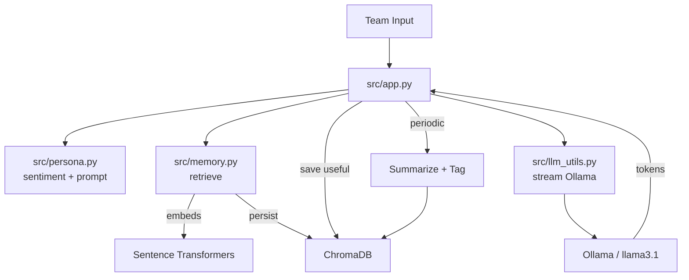

## Technical Architecture

### High-level Flow
1. Team sends a message in Streamlit.
2. App detects sentiment and builds a persona-aware prompt.
3. If enabled, retrieves relevant memory from ChromaDB (embeddings via MiniLM).
4. Sends composed prompt to Ollama; streams tokens back to UI.
5. Saves useful messages to memory; periodically summarizes to keep DB lean.

### Components
- `src/app.py`: UI, chat loop, prompt assembly, streaming UX, controls.
- `src/persona.py`: Persona config loading, sentiment detection, adaptive prompt generator, system prompt.
- `src/memory.py`: ChromaDB persistence, embeddings, retrieval, pinning, compaction, working goals.
- `src/llm_utils.py`: Ollama request helpers (streaming and non-streaming).

### Data Model (Memory)
- Document: message text
- Metadata: `{ role, ts, pinned?, pin_note?, type?, tags? }`
- ID: `${role}_${epoch_ms}` or `summary_${epoch_ms}`

### Diagram

### Non-goals
- External telemetry by default
- Heavy multi-service orchestration

