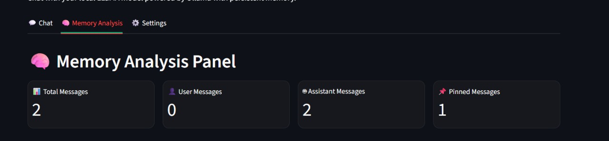

## Salient Features

- Team-focused addressing: “Exynos Thinkers”.
- Local-first inference via Ollama; no default cloud calls.
- Memory-augmented chat with ChromaDB, MiniLM embeddings, and smart compaction.
- Pinned messages and working goals for quick recall.
- Adaptive persona with sentiment-aware tone and structure.
- Mobile-friendly, modern UI with subtle AI visuals.
- Lightweight setup with a single Streamlit app and a local DB folder.

## Feature Screenshots

### Memory Analysis Panel

*The comprehensive memory analysis panel showing stored messages, memory statistics, pinned messages, and memory management tools. Users can inspect, pin, unpin, and delete stored conversations with full metadata visibility.*

### Key Memory Features
- **📊 Memory Statistics**: Total messages, user/assistant counts, pinned items
- **🔍 Message Inspection**: Detailed view of stored conversations with timestamps
- **📌 Pin Management**: Easy pinning and unpinning of important messages
- **🗑️ Memory Cleanup**: Delete specific messages or clear entire memory
- **🔄 Similarity Search**: Test semantic similarity between messages

