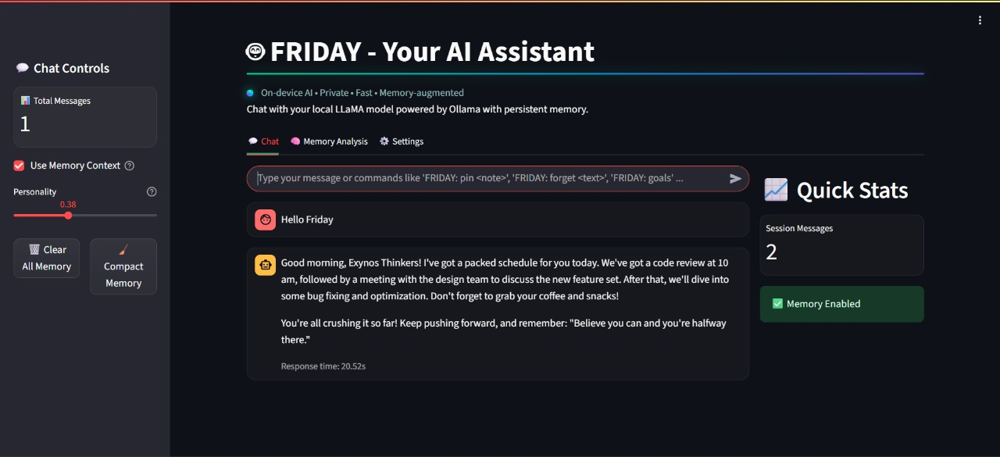

## FRIDAY ULTron — Overview and Approach

FRIDAY ULTron is a private, on-device chat assistant for teams, powered by local LLMs via Ollama. It augments conversations with a compact, queryable memory (ChromaDB + Sentence Transformers) and an adaptive persona that tunes tone and structure to team sentiment. The Streamlit UI is optimized for responsiveness and mobile use, with AI-themed visual feedback.

### Approach
- **Local-first privacy**: All inference runs through Ollama locally; no cloud calls by default.
- **Memory-augmented chat**: ChromaDB stores distilled, useful messages; retrieval blends relevance with recency and brevity.
- **Adaptive persona**: Tone and structure adapt to detected sentiment and a team-controlled personality config.
- **Operational simplicity**: Minimal services, single Streamlit app, quick setup script, and a self-contained DB folder.

### What makes it unique
- **Team addressing and context** focused on “Exynos Thinkers”.
- **Smart compaction**: Periodic summarization and tagging keep memory lean while retaining lasting facts.
- **Lightweight embeddings**: `all-MiniLM-L6-v2` enables fast vector ops on CPUs.
- **UI polish**: Subtle AI effects, glassmorphism, neon hovers, and mobile-friendly layout.

## App Interface Screenshots

### Main Welcome Interface

*The main welcome interface of FRIDAY ULTron, showcasing the AI-themed design with glowing title, animated background effects, and the three main tabs: Chat, Memory Analysis, and Settings.*

### Key Features Overview
- **🤖 Chat Tab**: Main conversation interface with memory-augmented responses
- **🧠 Memory Analysis**: Comprehensive memory inspection and management tools
- **⚙️ Settings**: Personality and memory configuration options

### Live Demo
https://github.com/user-attachments/assets/e64ef41a-4f75-45b5-b615-d8a860456d8d

*Watch FRIDAY in action! This demo video provides a comprehensive walkthrough of all features and capabilities.*

