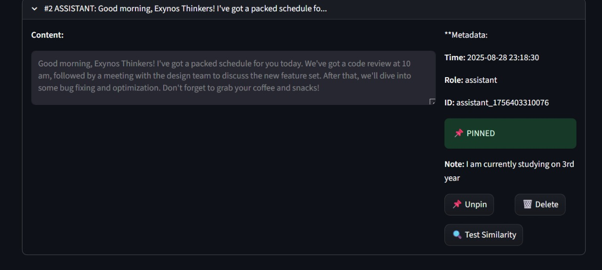

## User Guide

### Start
- Launch the app (see Installation). The title bar shows a pulsing underline and a short capability tagline.

### Chat
- Type into the chat input. Messages appear as glass cards.
- Streaming responses show in real time; response latency is shown below replies.

### Memory
- Toggle "Use Memory Context" in the sidebar to enable/disable retrieval.
- Pin important messages in the Memory Analysis tab; pinned items are highlighted and listed.
- Commands in chat:
  - `FRIDAY: pin <note>` — pins the last assistant message with a note.
  - `FRIDAY: forget <text>` — deletes up to 5 similar memories.
  - `FRIDAY: goals` — lists working goals.

### Settings
- Adjust personality sliders: motivational, comedy, directness.
- Toggle UI preferences: tags, latency monitor.
- Memory settings: short-term window, summary interval, max context messages.

### Tips
- Use concise, factual phrasing for content you want remembered.
- Explicitly state goals (e.g., "my goal is …") to add to working goals.

## Feature Screenshots

### Pin Functionality

*The pin functionality in action, showing how users can pin important messages with custom notes. This screenshot demonstrates the pinning workflow, message management, and the visual indicators for pinned content.*

### How to Use Pinning
1. **Find the message** you want to pin in the Memory Analysis tab
2. **Click the "📌 Pin" button** next to the message
3. **Add a descriptive note** explaining why it's important
4. **Confirm the pin** to save it to your pinned messages
5. **Access pinned items** from the dedicated "📌 Pinned Messages" section

